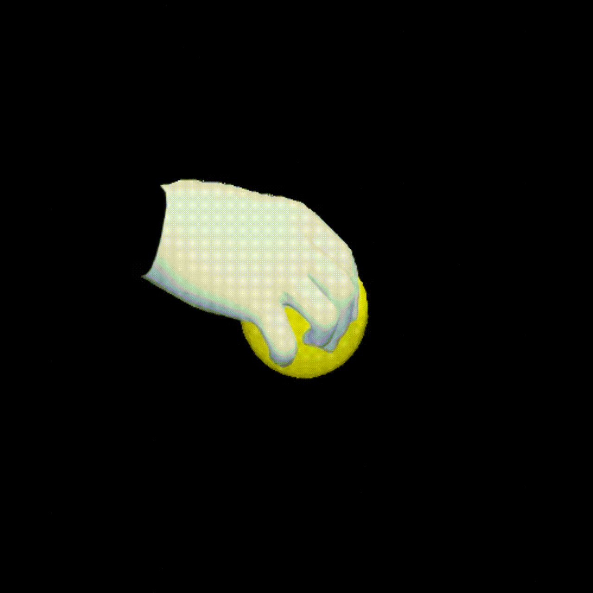
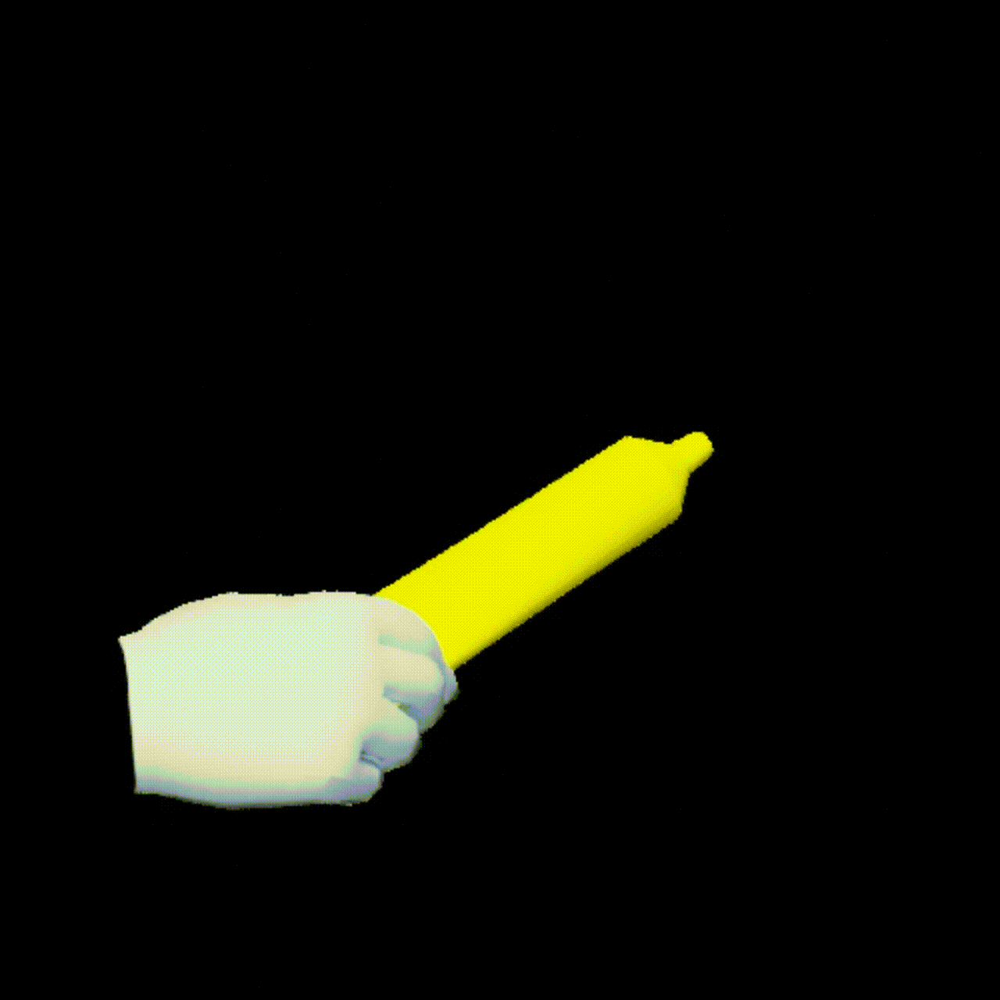
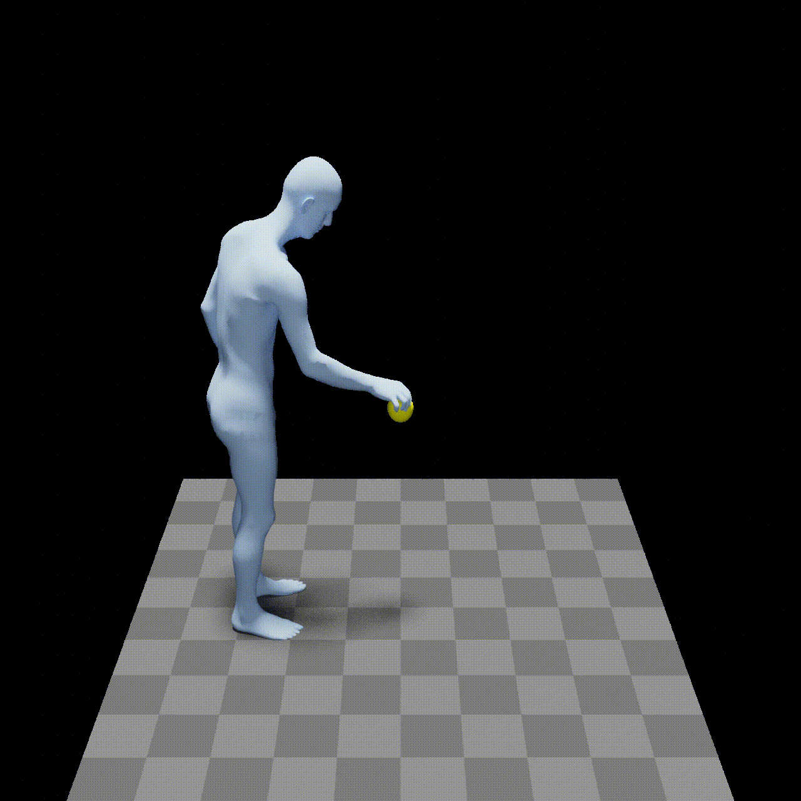
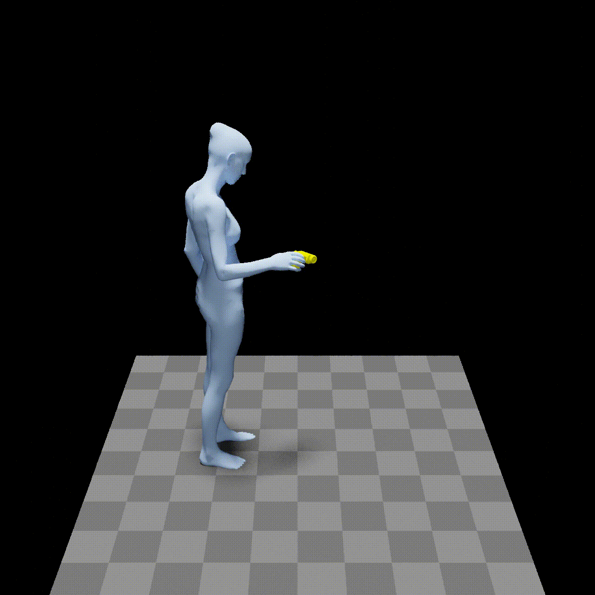
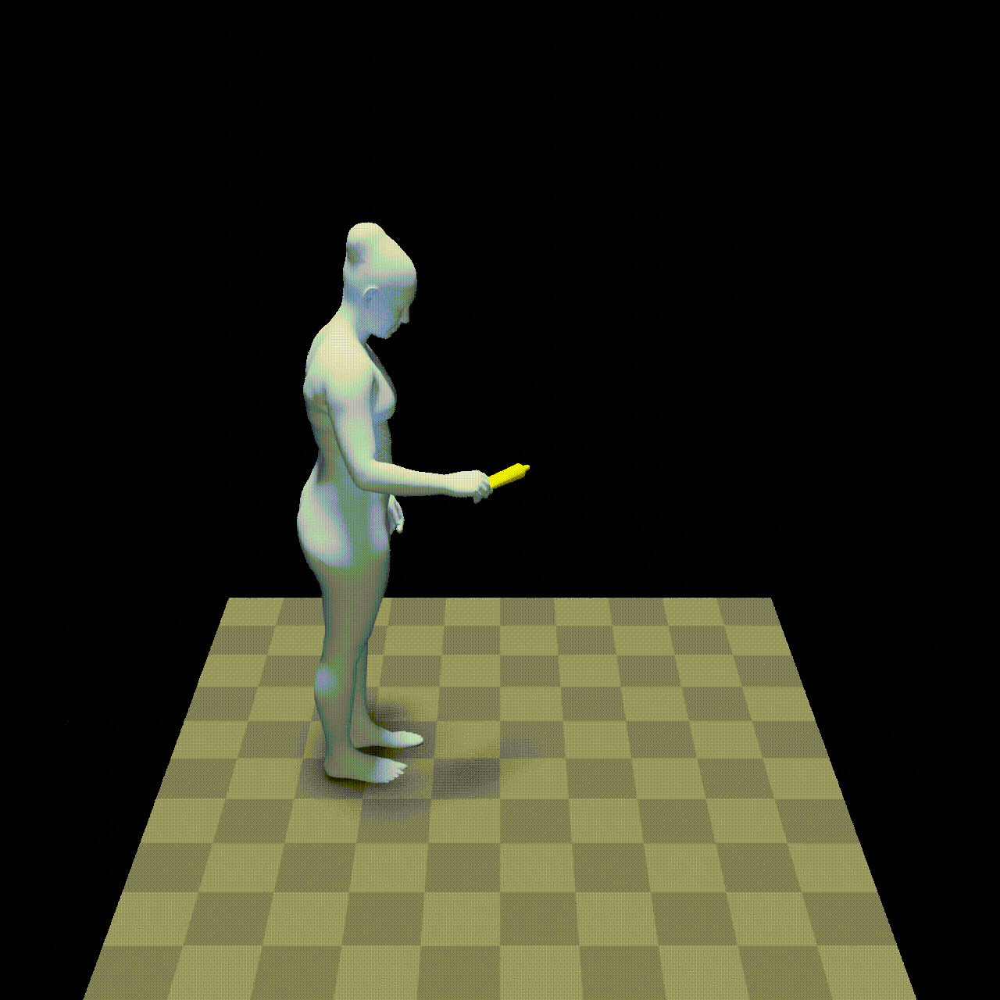
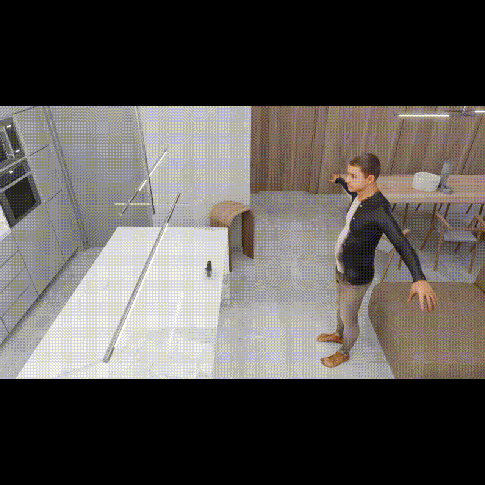
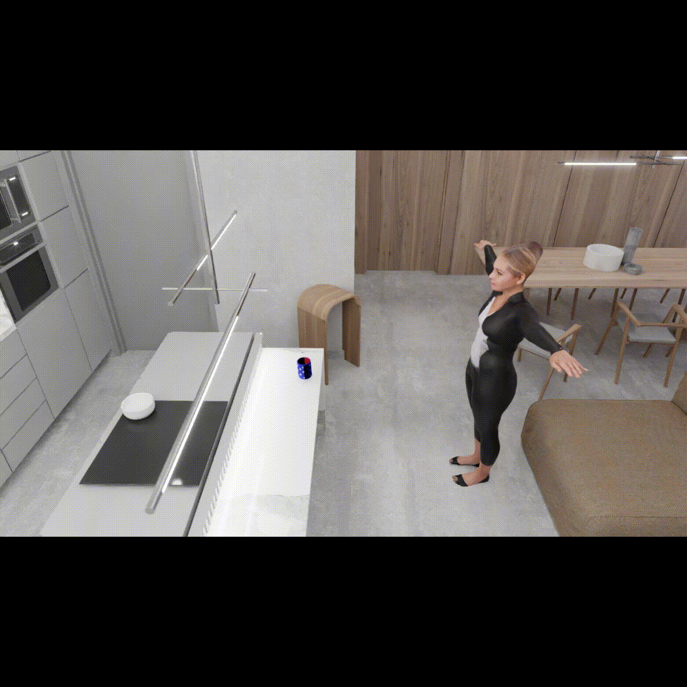
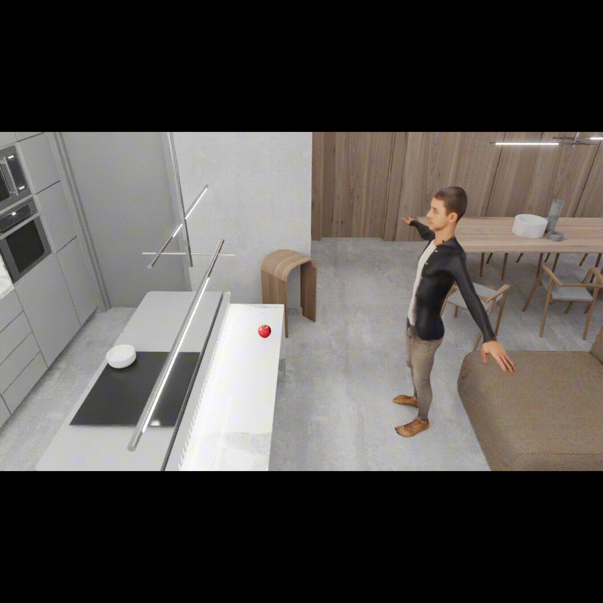

This repo is the official implementation for the CVPR2202 paper "GOAL: Generating 4D Whole-Body Motion for Hand-Object Grasping".


<p align="center">

  <h1 align="center">GOAL: Generating 4D Whole-Body Motion for Hand-Object Grasping</h1>
  <p align="center">
    <a href="https://ps.is.mpg.de/person/otaheri"><strong>Omid Taheri</strong></a>
    ·
    <a href="https://ps.is.mpg.de/person/vchoutas"><strong>Vassilis Choutas</strong></a>
    ·
    <a href="https://ps.is.tuebingen.mpg.de/person/black"><strong>Michael J. Black</strong></a>
    ·
    <a href="https://ps.is.mpg.de/~dtzionas"><strong>Dimitrios Tzionas</strong></a>
  </p>
  <h2 align="center">CVPR 2022</h2>
  <div align="center">
  </div>

  <a href="">
    
  </a>

  <p align="center">
  <br>
    <a href="https://pytorch.org/get-started/locally/"></a>
    <a href='https://arxiv.org/abs/2112.11454'>
      
    </a>
    <a href='https://goal.is.tue.mpg.de/' style='padding-left: 0.5rem;'>
      <br></br>

[//]: # (<a href='https://arxiv.org/abs/2112.09127'>)

[//]: # (      )

[//]: # (    </a>)

[//]: # (    <a href='https://icon.is.tue.mpg.de/' style='padding-left: 0.5rem;'>)

[//]: # (      )

[//]: # (    <a href="https://discord.gg/Vqa7KBGRyk"></a>)

[//]: # (    <a href="https://youtu.be/hZd6AYin2DE"></a>)
  </br>
    
   
  </p>
</p>

<!-- [[Project Website](https://goal.is.tue.mpg.de/)] [[arXiv Paper](https://arxiv.org/abs/2112.11454)] -->


[//]: # (### Run in Google-Colab)

[//]: # ([![Open In Google-Colab]&#40;https://colab.research.google.com/assets/colab-badge.svg&#41;]&#40;https://colab.research.google.com/drive/1c8OfrHhkwtyb0m75QHO0Dpj1IAgDcaqQ&#41;)


[GOAL](http://goal.is.tue.mpg.de) is a generative model that generates full-body motion of human body that walk and grasp unseen 3D objects. GOAL consists of two main steps:
1. **GNet** generates the final grasp of the motion.
2. **MNet** generates the motion from the starting to the grasp frame.
It is trained on the [GRAB](http://grab.is.tue.mpg.de) dataset.
For more details please refer to the [Paper](https://arxiv.org/abs/2112.11454) or the [project website](http://goal.is.tue.mpg.de).


### GNet
Below you can see some generated whole-body static grasps from GNet. The hand close-ups are from the same grasp, and for better visualization:

|            Apple             |                 Binoculars                 |                 Toothpaste                 |
|:--------------------------------:|:------------------------------------------:|:------------------------------------------:|
|  |  |  |
|     |     |     |


### MNet
Below you can see some generated whole-body motions that walk and grasp 3D objects using MNet:

|                   Camera                    |                   Mug                    |                   Apple                    |
|:-------------------------------------------:|:----------------------------------------:|:------------------------------------------:|
|  |  |  |


[//]: # (For more details check out the YouTube video below.)

[//]: # ()
[//]: # (|                          Video                           |)

[//]: # (|:--------------------------------------------------------:|)

[//]: # (| [![Video]&#40;images/vvv.png&#41;]&#40;https://youtu.be/s5syYMxmNHA&#41; |  )


## Table of Contents
  * [Description](#description)
  * [Requirements](#requirements)
  * [Installation](#installation)
  * [Getting Started](#getting-started)
  * [Examples](#examples)
  * [Citation](#citation)
  * [License](#license)
  * [Acknowledgments](#acknowledgments)
  * [Contact](#contact)


## Description

This implementation:

- Can run GOAL on arbitrary objects provided by users (incl. computing on the fly the BPS representation for them).
- Provides a quick and easy demo on google colab to generate fullbody grasps by GNet for any given object (MNet results coming soon).
- Can run GOAL on the test objects of our dataset (with pre-computed object centering and BPS representation).
- Can retrain GNet and MNet, allowing users to change details in the training configuration.


## Requirements
This package has the following requirements:

* [Pytorch>=1.7.1](https://pytorch.org/get-started/locally/) 
* Python >=3.7.0
* [pytroch3d >=0.2.0](https://pytorch3d.org/) 
* [MANO](https://github.com/otaheri/MANO) 
* [SMPLX](https://github.com/vchoutas/smplx) 
* [bps_torch](https://github.com/otaheri/bps_torch) 
* [psbody-mesh](https://github.com/MPI-IS/mesh)

## Installation

To install the dependencies please follow the next steps:

- Clone this repository: 
    ```Shell
    git clone https://github.com/otaheri/GOAL
    cd GOAL
    ```
- Install the dependencies by the following command:
    ```
    pip install -r requirements.txt
    ```

## Getting started

For a quick demo of GNet you can give it a try on [google-colab here]().

Inorder to use the GOAL models please follow the steps below:


#### GNet and MNet data
- Download the GRAB dataset from the [GRAB website](https://grab.is.tue.mpg.de), and follow the instructions there to extract the files.
- Process the GNet data by running the command below.
```commandline
python data/process_gnet_data.py --grab-path /path/to/GRAB --smplx-path /path/to/smplx/models/
```
- Process the MNet data by running the command below.
```commandline
python data/process_mnet_data.py --grab-path /path/to/GRAB --smplx-path /path/to/smplx/models/
```

#### GNet and MNet models
- Please download the GNet and MNet models from our website and put them in the folders as below.
```bash
    GOAL
    ├── models
    │   │
    │   ├── GNet_model.pt
    │   ├── MNet_model.pt
    │   └── ...
    │   
    │
    .
    .
    .
```


#### SMPLX models
- Download body models following the steps on the [SMPLX repo](https://github.com/vchoutas/smplx) (skip this part if you already followed this for [GRAB dataset](https://github.com/otaheri/GRAB)).


## Examples

After installing the *GOAL* package, dependencies, and downloading the data and the models from
 SMPLX website, you should be able to run the following examples:


[//]: # (- #### Generate several grasps for new unseen objects)

[//]: # (    )
[//]: # (    ```Shell)

[//]: # (    python test/grab_new_objects.py )

[//]: # (  ```)
                                            

- #### Generate whole-body grasps and motions for test split.
    
    ```Shell
    python test/GOAL.py --work-dir /path/to/work/dir --grab-path /path/to/GRAB --smplx-path /path/to/models/
    ```

- #### Train GNet with new configurations 
    
    To retrain GrabNet with a new configuration, please use the following code.
    
    ```Shell
    python train/GNet_train.py --work-dir path/to/work/dir --grab-path /path/to/GRAB --smplx-path /path/to/models/ --expr-id EXPERIMENT_ID

    ```
    
- #### Evaluate GNet on the test dataset 
    
    ```Shell
    python train/GNet_inference.py --work-dir path/to/work/dir --grab-path /path/to/GRAB --smplx-path /path/to/models/ --expr-id EXPERIMENT_ID
    ```

- #### Train MNet with new configurations 
    
    To retrain GrabNet with a new configuration, please use the following code.
    
    ```Shell
    python train/MNet_train.py --work-dir path/to/work/dir --grab-path /path/to/GRAB --smplx-path /path/to/models/ --expr-id EXPERIMENT_ID

    ```
    
- #### Evaluate MNet on the test dataset 
    
    ```Shell
    python train/MNet_inference.py --work-dir path/to/work/dir --grab-path /path/to/GRAB --smplx-path /path/to/models/ --expr-id EXPERIMENT_ID
    ```


## Citation

```
@inproceedings{taheri2021goal,
    title = {{GOAL}: {G}enerating {4D} Whole-Body Motion for Hand-Object Grasping},
    author = {Taheri, Omid and Choutas, Vasileios and Black, Michael J. and Tzionas, Dimitrios},
    booktitle = {Conference on Computer Vision and Pattern Recognition ({CVPR})},
    year = {2022},
    url = {https://goal.is.tue.mpg.de}
}
```
```
@inproceedings{GRAB:2020,
    title = {{GRAB}: {A} Dataset of Whole-Body Human Grasping of Objects},
    author = {Taheri, Omid and Ghorbani, Nima and Black, Michael J. and Tzionas, Dimitrios},
    booktitle = {European Conference on Computer Vision ({ECCV})},
    year = {2020},
    url = {https://grab.is.tue.mpg.de}
}

```

## License
Software Copyright License for **non-commercial scientific research purposes**.
Please read carefully the terms and conditions in the [LICENSE file](https://github.com/otaheri/GRAB/blob/master/LICENSE) and any accompanying documentation
before you download and/or use the GOAL data, model and software, (the "Data & Software"),
including 3D meshes (body and objects), images, videos, textures, software, scripts, and animations.
By downloading and/or using the Data & Software (including downloading,
cloning, installing, and any other use of the corresponding github repository),
you acknowledge that you have read these terms and conditions, understand them,
and agree to be bound by them. If you do not agree with these terms and conditions,
you must not download and/or use the Data & Software. Any infringement of the terms of
this agreement will automatically terminate your rights under this [License](./LICENSE).


## Acknowledgments

This research was partially supported by the International Max Planck Research School for Intelligent Systems (IMPRS-IS) and the Max Planck ETH Center for Learning Systems (CLS);
Omid Taheri is with IMPRS-IS and Vassilis Choutas is with CLS.

We thank:

* Tsvetelina Alexiadis for helpign with the MTurk study.
* Taylor McConnell for the voice-overs.
* Joachim Tesch for the help with renderings.
* Jonathan Williams for the website design, and Benjamin Pellkofer for the IT and web support.

## Contact
The code of this repository was implemented by [Omid Taheri](https://ps.is.tuebingen.mpg.de/person/otaheri) and [Vassilis Choutas](https://ps.is.tuebingen.mpg.de/person/vchoutas).

For questions, please contact [goal@tue.mpg.de](goal@tue.mpg.de).

For commercial licensing (and all related questions for business applications), please contact [ps-licensing@tue.mpg.de](ps-licensing@tue.mpg.de).
